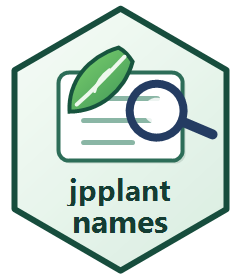

# jpplantnames



`jpplantnames`
は、[JBIF](https://gbif.jp/activities/checklist/wamei_checklist_110/)
が公開する 「維管束植物和名チェックリスト ver.
1.10」を利用して、和名から学名を調べるための 非公式 R パッケージです。

ドキュメントサイト: <https://maple60.github.io/jpplantnames/>

English README: <https://maple60.github.io/jpplantnames/>

## インストール

``` r

# install.packages("pak")
pak::pak("maple60/jpplantnames")
```

## すぐに使う

``` r

library(jpplantnames)

japanese_name_info("コナラ")

scientific_name("コナラ")
#> [1] "Quercus serrata"

scientific_name("コナラ", with_author = TRUE)
#> [1] "Quercus serrata Murray"

japanese_name_search("コナラ")
```

最初にチェックリストデータが必要になった時点で、Excel
ファイルをユーザーの R キャッシュへダウンロードします。その後の
[`scientific_name()`](https://maple60.github.io/jpplantnames/reference/scientific_name.md)、[`japanese_name_search()`](https://maple60.github.io/jpplantnames/reference/japanese_name_search.md)、
[`japanese_name_load()`](https://maple60.github.io/jpplantnames/reference/japanese_name_load.md)
はローカルのキャッシュファイルを読むため、検索のたびに外部サーバーへ
問い合わせることはありません。キャッシュを明示的に更新したい場合は次のようにします。

``` r

japanese_name_download(overwrite = TRUE)
japanese_name_load(refresh = TRUE)
```

[`gbif_match()`](https://maple60.github.io/jpplantnames/reference/gbif_match.md)
は別扱いで、実行時に GBIF API へ問い合わせます。

和名から情報をまとめて確認したい場合は、便利な入口として
[`japanese_name_info()`](https://maple60.github.io/jpplantnames/reference/japanese_name_info.md)
が使えます。
既定ではキャッシュ済みのチェックリストデータだけを使います。WFO や GBIF
の確認は任意で、 外部データベースの内容や API の利用可否に依存します。

``` r

japanese_name_info("コナラ", wfo = TRUE)
japanese_name_info("コナラ", wfo = TRUE, gbif = TRUE)
```

## ガイド

- [日本語:
  使い方ガイド](https://maple60.github.io/jpplantnames/articles/ja-get-started.html)
- [English: Usage
  guide](https://maple60.github.io/jpplantnames/articles/get-started.html)
- [日本語:
  メンテナンスガイド](https://maple60.github.io/jpplantnames/articles/ja-maintenance.html)
- [English: Maintenance
  guide](https://maple60.github.io/jpplantnames/articles/maintenance.html)
- [日本語:
  パッケージ開発チュートリアル](https://maple60.github.io/jpplantnames/articles/ja-package-development.html)
- [English: Package development
  tutorial](https://maple60.github.io/jpplantnames/articles/package-development.html)
- [関数リファレンス](https://maple60.github.io/jpplantnames/reference/index.html)

## 国際的な学名確認

[`gbif_match()`](https://maple60.github.io/jpplantnames/reference/gbif_match.md)
は GBIF species match API を呼び出す薄い補助関数です。
チェックリストから得た学名を国際的な生物多様性データソースで確認したい場合に使います。

``` r

gbif_match("Quercus serrata")
```

### WFO Plant List checks

[`scientific_name()`](https://maple60.github.io/jpplantnames/reference/scientific_name.md)
はチェックリストの学名を返します。[`wfo_suggest()`](https://maple60.github.io/jpplantnames/reference/wfo_suggest.md)
は WFO の候補名を確認し、
[`wfo_accepted_name()`](https://maple60.github.io/jpplantnames/reference/wfo_accepted_name.md)
は WFO 上での採用名の解釈を 1 行にまとめます。これらの関数は
チェックリストの結果を自動で置き換えません。WFO API
は小規模な対話的確認に使い、大きな処理では キャッシュを使い、使った WFO
のリリースやバージョンを記録してください。

``` r

sci <- scientific_name("コナラ")
sci
#> [1] "Quercus serrata"

wfo_suggest(sci)
wfo_accepted_name(sci)
```

## データソースと引用

`jpplantnames` は「維管束植物和名チェックリスト ver. 1.10」を lookup
source として使います。 このチェックリストには YList
由来・更新データが含まれますが、`jpplantnames` は JBIF、YList、
またはチェックリスト著者の公式パッケージではなく、承認・推奨されたものでもありません。

チェックリストに基づく結果を利用する場合は、チェックリストを引用してください。

> 山ノ内崇志・首藤光太郎・大澤剛士・米倉浩司・加藤 将・志賀 隆. 2019.
> 「維管束植物和名チェックリスト」
> (<https://gbif.jp/activities/checklist/wamei_checklist_110>)

このパッケージのコードは MIT
ライセンスです。ただし、チェックリストデータはパッケージに同梱しておらず、
このパッケージのライセンス対象ではありません。

旧
[`academic_name()`](https://maple60.github.io/jpplantnames/reference/scientific_name.md)
と `ylist_*()` 関数名は、互換性のため非推奨ラッパーとして残しています。
